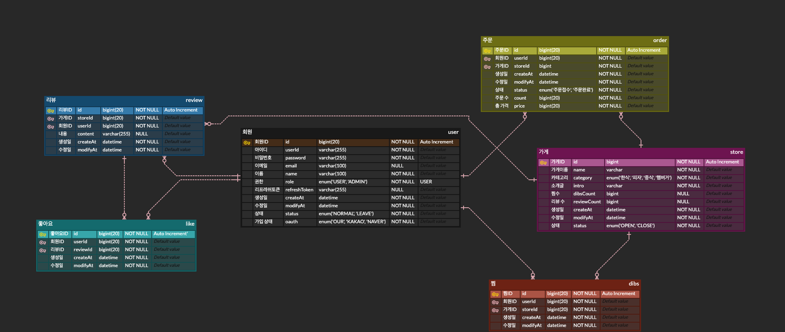

#  파이브 레전드

---

## ★목차
[1. 팀 소개]( #1-legendofdelivery )

[2. 코드 컨벤션]( #2-코드-컨벤션 )

[3. 필수 구현 기능]( #3-필수-요구-사항 )

[4. 추가 구현 기능]( #4-추가-구현-기능 )

[5. API 명세서]( #5-api-명세서 )

[6. ERD]( #6-erd)

## 1.  LegendOfDelivery

---

- 소개

    - 한 줄 정리 : 배달 어플의 기능을 구현해보는 프로젝트
    - 내용 :

  레전드 오프 딜리버리는 고객들에게 빠르고 안전한 배송을 보장합니다. 우리는 다양한 상황에 대응할 수 있는 유연성과 전문성을 자랑하며, 모든 상품을 신속하게 목적지로 전달합니다. 우리의 팀은 고객의 요구를 항상 우선시하며, 최고의 서비스 품질을 제공하기 위해 훈련을 받고 있습니다.

  우리는 환경을 생각하는 회사로서 친환경 포장재를 사용하고, 배송 과정에서의 에너지 소비를 줄이기 위해 지속적으로 노력하고 있습니다. 또한, 고객들에게는 정확한 배송 시간과 위치를 제공하여 투명하고 신뢰할 수 있는 서비스를 제공합니다.

  레전드 오프 딜리버리는 다양한 산업 분야에서의 경험과 신속한 대응력을 바탕으로 고객들의 신뢰를 얻고 있습니다. 우리와 함께라면 언제나 안심하고 배송 서비스를 이용할 수 있습니다.

  
- 목표 

- #### 파이브 레전드의 목표

    - "자바 스프링 부트를 활용한 고성능 웹 애플리케이션 개발 및 배포"

-  #### 구체적인 목표 항목

    - 기초 학습 및 이해

   자바 스프링 부트의 기본 개념과 구조를 이해하고,
   각 구성 요소의 역할과 기능을 숙지합니다.
   스프링 부트의 설정과 프로젝트 생성 방법을 학습합니다.

- #### 핵심 기술 습득

  RESTful API 개발
  스프링 부트를 사용하여 RESTful 웹 서비스와 API를 설계하고구현합니다.
  데이터베이스 연동
  JPA와 스프링 데이터 등을 사용하여 데이터베이스와의 연동을 학습하고 구현합니다.
  보안: 스프링 시큐리티를 사용하여 인증과 권한 부여를 구현합니다.

- #### 고급 기능 활용

마이크로서비스 아키텍처
스프링 부트를 활용하여 마이크로서비스 아키텍처를 설계하고 구현합니다.
클라우드 배포
AWS, Azure, Google Cloud 등 클라우드 환경에 스프링 부트 애플리케이션을 배포합니다.
성능 최적화
애플리케이션의 성능을 모니터링하고, 최적화 기술을 적용하여 고성능을 유지합니다.

프로젝트 구현
실제 프로젝트를 통해 자바 스프링 부트 기술을 실습하고,
팀원 간의 협업을 통해 완성도 높은 애플리케이션을 개발합니다.
애자일 방법론을 적용하여 주기적인 스프린트를 통해 개발 과정을 관리하고,
지속적으로 개선합니다.

공유와 발표
프로젝트 결과물을 발표하고, 팀의 성과와 배운 점을 공유합니다.
깃허브와 같은 오픈 소스 플랫폼에 프로젝트를 공개하여 다른 개발자들과 지식을
나누고 피드백을 받습니다.
이 목표를 통해 "파이브 레전드" 팀은 자바 스프링 부트의 전문가로 성장하며,
고성능 웹 애플리케이션을 성공적으로 개발하고 배포하는 경험을 쌓을 수 있을 것입니다

- **개발환경**
    - Java 17
    - Spring Boot 3.3.0
    - MySQL 8.0.28
    - Spring Security
    - JWT
    - JPA
    - GitHub
## WBS & Tasks

- ### 함승완

    - 관리자 페이지

- ### 김지수A

    - 리뷰 CRUD

- ### 유균한

    - 사용자, 마이페이지, Spring Security 인가

- ### 정효진

    - 좋아요, 찜 기능 구현

- ### 최연환

    - 주문 CRUD

## 2. 코드 컨벤션

---

https://www.notion.so/teamsparta/Code-Convention-e8414eb6d23d4406a71ea016c54539df

---

## 3. 😀필수 요구 사항

---
### 개발 프로세스 가이드

- **1단계. 프로젝트 아이디어 구상하기!**

    <aside>
    💡 **우리에게 주어진 과제는 무엇이 있을까?** 를 진지하게 성찰하는 시간

    </aside>

    - 백오피스 프로젝트를 시작하기 전에 여러분들의 프로젝트의 방향성을 결정하는 것이 매우 중요합니다!
        - 주제 1. SNS 사이트 만들기 (ex. Threads)

            - 트위터의 대체재로 떠오르고 있는 Threads 를 사이트로 만들어보는 시간을 가져봅시다! 게시글, 댓글, 좋아요, 팔로우 기능까지 있는 여러분들만의 Threads 사이트를 만들어보세요.

        - 주제 2. 배달주문 사이트 만들기 (ex. 배달의민족)

            - 초기에 했던 키오스크 프로젝트의 업그레이드 해서 배달의민족 사이트를 만들 수 있습니다. 메뉴판을 만들고 장바구니에 메뉴를 담고 주문하고 완료처리하고 리뷰까지 남기는 기능들을 포함한 배달의민족 사이트로 만들어보세요.

        - 주제 3. 익명커뮤니티 사이트 만들기 (ex. Blind)

            - 익명 게시판의 대표주자인 Blind 앱같은 사이트를 만들어보는 시간을 가져봅시다! 익명 계정을 기반으로 게시글, 댓글, 좋아요 기능이 있는 여러분들만의 Blind 사이트를 만들어보세요.

        - 여기서 중요한 것은 뭘까요? 지금 까지 학습했던 CRUD 기능을 잘 활용할 수 있는 서비스 이면서 이번 프로젝트의 목적인 백오피스(관리시스템)이 필요한 서비스를 기획 하는게 중요합니다.

- **2단계. API 명세 작성하기!**
    - 프로젝트 아이디어 구상이 완료가 되었다면 현실화 할 수 있는 기능들을 API 명세를 작성해야 합니다.

- **3단계. ERD 작성하기!**

- API 명세가 작성 되었다면, 유저들의 데이터를 저장할 데이터베이스 스키마를 설계해야하고 이는 ERD로 표현되어야 합니다!
- ERD를 사용하면 팀원들이 서비스의 데이터베이스의 구조를 쉽게 이해하고 더 효과적인 데이터베이스 설계를 할 수 있어요!
- ERD를 설계할 때는 아래에 해당되는 속성들을 정의하고 ERD 설계를 하셔야해요!
    - E(Entity. 개체)
        - 여러분들의 서비스에서 필요로 하는 데이터를 담을 개체를 식별하도록 해요.
            - 예를 들어, `사용자`, `게시물`, `댓글` 등이 될 수 있어요.
    - A(Attribute. 속성)
        - 각 개체가 가지는 속성을 정의하도록 해요.
            - 예를 들어, 사용자 개체는 `이름`, `로그인 아이디`, `비밀번호` 등의 속성을 가질 수 있어요.
    - R(Relationship. 관계)
        - 개체들 사이의 관계를 정의하도록 해요.
            - 예를 들어, 사용자와 게시물 사이에는 `작성하다`라는 관계가 있을겁니다.

- **~~4단계. 와이어프레임 작성하기!~~**

    - Figma나 Sketch 혹은 Draw.io와 같은 SaaS를 사용해도 좋고요. 아니면 파워포인트나 키노트와 같이 어플리케이션을 사용해도 상관이 없습니다. 이쁘지 않아도 좋으니 우리 서비스의 형태에 대해서는 구체적으로 정의가 되어야 합니다!
    - 이 와이어프레임을 그리면서 여러분들은 UI/UX를 설계를 하시는 거에요. 또한, 기능 목록에 빠진 기능은 없는지 체크하고 어떠한 기능이 있으면 더 좋을 것 같은지에 대해서 구상을 해 볼 수 있습니다.
    - 이때 7단계에서 할 백오피스 개발을 위해, 서비스 데이터 관리자용 기능 목록들도 함께 정리해보세요.
      (ex. 유저 관리/게시글 관리 등…)

- **5단계. 본격적인 백엔드 개발하기!**
    - Spring 이용하여 본격적으로 서버를 개발합니다.
    - 항상 여러분들이 구현하셨던 CRUD 기능은 물론이고 이번에는 여러분들이 열심히 공부한 쿠키, 세션, 토큰과 같은 개념을 응용하여 사용자 인증과 인가와 같은 기능들도 완벽하게 구현을 할 수 있도록 해봐요!

- **6단계. 테스트 및 버그 수정하기!**
    - 개발한 기능들이 제대로 작동하는지 테스트해봅니다.
    - 테스트 코드를 꼭 작성해주세요.

- 7**단계. 백오피스 개발하기!**
    - 지금까지 구현한 기능에 권한을 추가하여 권한에 따라 기능의 동작 여부를 결정합니다.
    - 인가(Authorization) 개념에 대해 제대로 적용해 볼 수 있습니다.
    - 이제 백오피스를 통해 서비스를 모니터링 및 관리할 수 있습니다.

<aside>
❗  공통 조건

</aside>

- 클라이언트는 Postman이고 프론트엔드는 별도 구현하지 않습니다.
- **사용자 인증 기능 공통 조건**
    - **username**, **password**를 클라이언트에서 전달 받습니다.
    - **Spring Security**와 **JWT**를 사용하여 설계 및 구현합니다.
    - JWT는 **Access Token**, **Refresh Token**을 구현합니다.
    - Access Token 만료 시 : **유효한 Refresh Token**을 통해 새로운 Access Token과 Refresh Token을 발급
    - Refresh Token 만료 시 : **재로그인**을 통해 새로운 Access Token과 Refresh Token을 발급
    - API를 요청할 때는 Access Token을 사용합니다.
    - Access Token, Refresh Token은 동시에 전달을 하는게 아니고 용도에 맞게 사용되어야 합니다.

<aside>
✅ **필수 구현 기능**

</aside>

- **사용자 인증 기능**
    - 조건
        - username: `최소 4자 이상, 10자 이하이며 알파벳 소문자(a~z), 숫자(0~9)`
        - password: `최소 8자 이상, 15자 이하이며 알파벳 대소문자(a~z, A~Z), 숫자(0~9), 특수문자`
    - 회원가입 기능
        - 성공
            - DB에 중복된 `username`이 없다면 회원을 저장한다.
            - 클라이언트에 성공 메시지와 상태코드를 반환한다.
            - 응답은 content-type application/json 형식입니다.
            - 회원 권한 부여
                - ADMIN
                    - 모든 게시글, 댓글 수정과 삭제 가능
                - USER
                    - 본인이 작성한 게시글, 댓글에 한하여 수정과 삭제 가능
        - ⚠️ 필수 예외처리
            - DB에 중복된 `username`이 이미 존재하는 경우
            - `username`,`password` 조건에 맞지 않는 경우
        - 참고자료
            1. https://mangkyu.tistory.com/174
            2. [https://ko.wikipedia.org/wiki/정규_표현식](https://ko.wikipedia.org/wiki/%EC%A0%95%EA%B7%9C_%ED%91%9C%ED%98%84%EC%8B%9D)
            3. https://bamdule.tistory.com/35
    - 로그인 기능

      사용자는 자신의 계정으로 서비스에 **로그인**할 수 있습니다.

        - 성공
            - DB에서 `username`을 사용하여 회원가입 된 사용자인지 확인한다.
            - 회원가입 된 사용자라면 `password`를 비교하여 로그인한다.
            - **header**에 토큰을 추가하고 성공 상태코드와 메세지를 반환합니다.
        - ⚠️ 필수 예외처리
            - 유효하지 않은 사용자 정보로 로그인을 시도한 경우

              ex. 회원가입을 하지 않거나 회원 탈퇴한 경우

            - `username`과 `password`가 일치하지 않는 사용자 정보로 로그인을 시도한 경우
    - 로그아웃 기능

      사용자는 로그인 되어 있는 본인의 계정을 **로그아웃** 할 수 있습니다.

        - 조건
            - 로그아웃 시, 발행한 토큰은 **초기화** 합니다.
            - 로그아웃 후 초기화 된 `Refresh Token`은 재사용할 수 없고 재로그인해야 합니다.
- **프로필 관리**
    - 비밀번호 수정 조건
        - 비밀번호 수정 시, 본인 확인을 위해 현재 비밀번호를 입력하여 올바른 경우에만 수정할 수 있습니다.
        - 비밀번호는 현재 비밀번호 및 최근 사용한 세 개의 비밀번호와 다르게 설정해야 합니다.
            - 예시) 현재 비밀번호가 'currentPass'이고 이전 비밀번호가 'password1', 'password2', 'password3'였다면 새로운 비밀번호는 이 네 개와 다른 새로운 비밀번호여야 합니다.
    - 프로필 수정 기능
        - 이름, 한 줄 소개와 같은 기본적인 정보를 볼 수 있어야 하며 수정할 수 있어야 합니다.
- **게시물 CRUD 기능 (배달앱일 경우 : 주문 CRUD 기능)**
    - 조건
        - 게시물 작성, 수정, 삭제는 **인가(Authorization)**가 필요합니다.
        - 유효한 JWT 토큰을 가진 작성자 본인만 처리할 수 있습니다.
        - 조회
            - 모든 사용자가 전체 게시물 데이터를 조회할 수 있습니다.
            - 기본 정렬은 **생성일자 기준으로 최신순**으로 정렬합니다.
            - 페이지네이션
                - 페이지네이션하여 각 페이지 당 게시물 데이터가 5개씩 나오게 합니다.
    - ⚠️ 필수 예외처리
        - 작성자가 아닌 다른 사용자가 게시물 작성, 수정, 삭제를 시도하는 경우
    - 예시) 배달앱
        - 주문 작성, 조회, 수정, 삭제 기능
        - 주문 → 게시글 (주문은 곧 게시글과 같습니다.)
        - 주문목록 → 게시판 (주문목록은 곧 게시판과 같습니다.)
        - 주문한 사람만 메뉴를 수정하고 삭제할 수 있습니다.
- **댓글 CRUD 기능 (배달앱일 경우 : 리뷰 CRUD 기능)**
    - 조건
        - 사용자는 게시물에 댓글을 작성할 수 있고, 본인의 댓글은 **수정 및 삭제**를 할 수 있습니다.
        - **내용**만 수정이 가능합니다.
        - 댓글 작성, 수정, 삭제는 **인가(Authorization)**가 필요합니다.
        - 유효한 JWT 토큰을 가진 작성자 본인만 처리할 수 있습니다.
            - 예) 본인이 작성한 댓글 외엔 수정 및 삭제 불가
    - 예시) 배달앱
        - 리뷰 작성, 조회, 수정, 삭제 기능
        - 주문자만 본인이 주문한 항목에 대한 리뷰를 생성할 수 있습니다.
        - 주문자만 해당 리뷰를 수정하고 삭제할 수 있습니다.

## 4. 😃추가 구현 기능

---

- **공통 조건**
    - 추가 구현 기능을 구현하시는 팀은 이전 과제들에서 받았던 피드백을 최대한 반영하여 기능의 완성도 혹은 코드의 품질을 높여봅시다.

- **백오피스 만들어보기** [**⭐**](https://emojipedia.org/star/)
    - 개요
        - **백오피스**란 서비스를 제공하기 위하여 상품을 등록하고 마케팅을 설정하고 결제와 매출, 수익 등을 관리하는 서비스를 제공하는 페이지입니다.
        - 일반적으로 관리자 사이트, ERP 도구 등으로 표현됩니다.
        - 화면은 구현하지 않지만 백오피스 예시입니다.

          일반적인 회원관리 페이지

          우리에게 너무나도 익숙한 네이버 블로그 백오피스

    - 조건
        - ADMIN 권한을 지닌 사용자는 아래 작성된 기능이 가능해야 합니다.
            - 사용자 전체 목록을 조회할 수 있습니다.
            - 사용자 권한을 수정하고 삭제할 수 있습니다.
            - 게시글과 댓글 전체 목록을 조회할 수 있습니다.
            - 게시글을 수정하고 삭제할 수 있습니다.
        - 예시) 배달앱
            - 메뉴, 주문, 리뷰 전체 목록을 조회할 수 있습니다.
            - 메뉴에 대해 생성하고 수정 그리고 삭제할 수 있습니다.
    - 관리자 API 개발
        - 회원종류
            - USER: 일반 회원
            - ADMIN: 관리자
        - **예시)** 백오피스 API
            - 회원 관리
                1. 전체 회원 조회하기
                2. 특정 회원 정보 수정하기
                3. 특정 회원 삭제하기
                4. 특정 회원 관리자로 권한 변경
                5. 특정 회원 차단하기
            - 게시글 관리
                1. 공지글 등록하기
                2. 특정 게시글 수정하기
                3. 특정 게시글 삭제하기
                4. 특정 게시글 상단에 고정
                1. 구글 광고처럼
            - 배달 앱 메뉴 및 주문 관리
                1. 특정 메뉴 수정하기
                2. 특정 주문 수정하기
                1. 완료 혹은 취소 처리와 같은 진행상황 변경
                3. 특정 주문 삭제하기

- **좋아요 기능**
    - **게시물 및 댓글 좋아요 / 좋아요 취소 기능**
        - 사용자가 게시물이나 댓글에 좋아요를 남기거나 취소할 수 있습니다.
        - 본인이 작성한 게시물과 댓글에 좋아요를 남길 수 없습니다.
        - 같은 게시물에는 사용자당 한 번만 좋아요가 가능합니다.
- **팔로우 기능 구현**
    - 특정 사용자를 팔로우 / 언팔로우를 할 수 있습니다.
    - 팔로우 기능이 구현되었다면 뉴스피드에 팔로우하는 사용자의 게시물을 볼 수 있습니다.
    - 팔로우를 하고 있는 사람들이 작성한 게시물을 볼 때 정렬 기준은 최신순입니다.
- **소셜 로그인 기능 구현**
    - [네이버 로그인 개발가이드](https://developers.naver.com/docs/login/devguide/devguide.md)를 참고하여 네이버 로그인을 구현해보세요.

      [네이버 로그인 API 명세 - LOGIN](https://developers.naver.com/docs/login/api/api.md)

    - [카카오 로그인 개발가이드](https://developers.kakao.com/docs/latest/ko/kakaologin/common)를 참고하여 카카오 로그인을 구현해보세요.

      [Kakao i 기술문서](https://docs.kakaoi.ai/kakao_i_connect_message/bizmessage/api/api_reference/oauth/)

## 5. API 명세서

---
https://www.notion.so/teamsparta/a6cb2a87b9654cefbd2b21e274e91e9a?v=6b4a60707a2243d68e02cf0c4fdcc6b6&pvs=

## 6. ERD

---

## 7. KPT 회고

---
https://www.notion.so/teamsparta/KPT-cb0227cbd92444e1aedd61119c077019